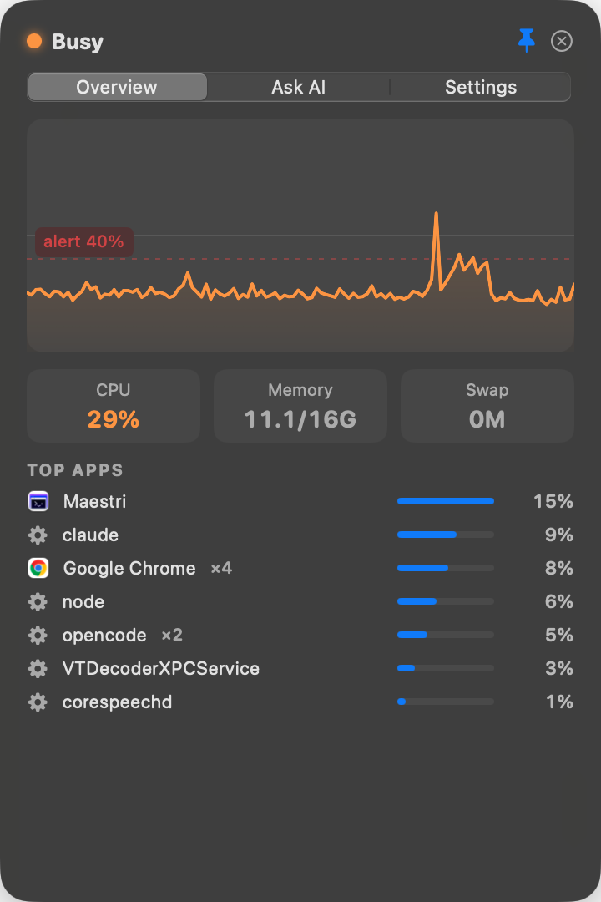
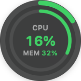
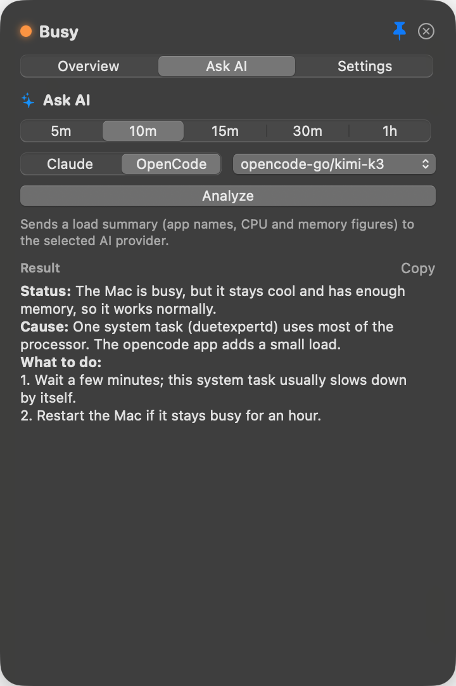

# FanBubble

**Find what makes your Mac hot and loud.**

FanBubble is a small macOS menu-bar app. It stays hidden while your Mac is calm. When the processor stays busy or the Mac gets hot, a bubble shows the load. Click the bubble to see the apps that cause it.

  

**[Download the latest beta](../../releases)** · macOS 14 or later · signed and notarized by Apple

---

## The bubble

The bubble has two rings. The outer ring shows processor load. The inner ring shows memory pressure. The colours change from green to orange to red as the load increases.

The bubble shows itself when the load stays above your alert level. It hides itself again when your Mac is calm.

## The menu-bar icon

The menu-bar icon has the same two rings. It shows the load when the bubble is hidden. Click it to show or hide the bubble.

## Top apps

The panel shows the apps that use the processor now. FanBubble groups the processes of each app, so Chrome is one row (`×4` shows the number of processes).

To stop an app, click its row and then click **Quit**. The list does not move while you decide.

## Ask AI

  

Ask AI gives a short explanation in plain English: the status, the cause, and what to do. It uses your own `claude` or `opencode` command-line tool. It is optional.

## Install

1. Download the newest `.dmg` file from [Releases](../../releases).
2. Open the `.dmg` file.
3. Drag FanBubble to the Applications folder.
4. Open FanBubble from the Applications folder.

To start FanBubble when you log in, open the panel, click **Settings**, and turn on **Launch at login**.

## This is a beta

FanBubble can contain errors. It does not update itself. To get a message when a new version is available, click **Watch → Custom → Releases** on this page.

## Send feedback

Open an [issue](../../issues/new), or click **Send feedback** in FanBubble's Settings. Tell us:

- your Mac model and macOS version,
- what you did,
- what you expected, and what happened.

## Privacy

FanBubble collects no data. It has no analytics and sends no data in the background.

Ask AI sends data only when you click **Analyze**. It sends a load summary (app names, processor and memory figures) to the AI provider that you select.

**WARNING:** **Quit** stops all processes of the selected app. Save your work in that app first. FanBubble does not stop system processes.
