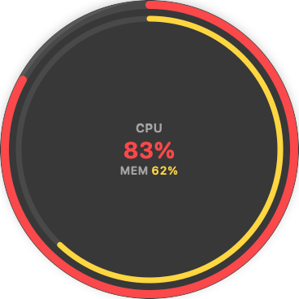

# FanBubble (beta)

FanBubble is a small macOS menu-bar app. It finds what makes your Mac hot and loud.

It stays hidden while your Mac is calm. When the processor stays busy or the Mac gets hot, a bubble shows the load. Click the bubble to see the apps that cause it.

  
  
  

Screenshots use sample data.

## Features

- A bubble with two rings: processor load (outside) and memory pressure (inside).
- A menu-bar icon with the same two rings. It shows the load when the bubble is hidden.
- The top apps, grouped per app, with the processor load of each app.
- Quit an app from the list. FanBubble asks you to confirm first.
- Ask AI: an optional, short explanation in plain English. It uses your own `claude` or `opencode` command-line tool.

## Install

1. Download the newest `.dmg` file from [Releases](../../releases).
2. Open the `.dmg` file.
3. Drag FanBubble to the Applications folder.
4. Open FanBubble from the Applications folder.

The app is signed and notarized by Apple. It opens without a security warning.

Requires macOS 14 or later.

## This is a beta

FanBubble is in beta. It can contain errors.

FanBubble does not update itself. Watch this repository (Watch → Custom → Releases) to get a message when a new version is available.

## Send feedback

Open an [issue](../../issues/new). Tell us:

- your Mac model and macOS version,
- what you did,
- what you expected, and what happened.

Ideas are welcome too.

## Privacy

FanBubble collects no data. It has no analytics and sends no data in the background.

Ask AI sends data only when you click Analyze. It sends a load summary (app names, processor and memory figures) to the AI provider that you select.

WARNING: "Quit" stops all processes of the selected app. Save your work in that app first. FanBubble does not stop system processes.
